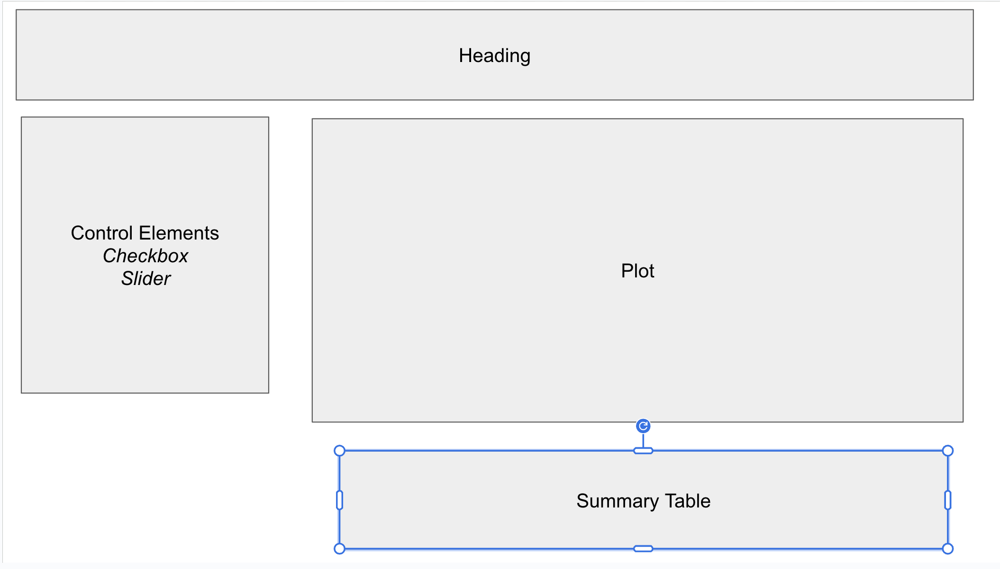

# Quick Reference

This serves as a quick reference for the Shiny App. This app will use the `iris` data set.  I want to plot a scatter plot of Sepal Width by Petal Width, and have summaries of means for each variable broken up by Species. You can use a checkbox to change the plot to color the scatter by Species if desired.  You can also use the slider to filter the data set to remove all flowers with a Petal With below a chosen *minimum petal width*.

[Shiny Gallery for Quick Reference](https://shiny.posit.co/r/gallery/)

### Layout description
Header going across the top, a small column for the control elements (slider and checkbox), the rest is given to the main plot in that row.  Below the main plot we have our summary table.

### Inputs
The bullets below take the general form:

> shiny Component  |  **variable_name** | optional: args

* checkboxInput | **show_color** | values = FALSE
* sliderInput | **min_petal_width** | min =.09, max = 2.6, value =.09, step = .01

### Outputs
The bullets below take the general form:

> Shiny Component  |  **variable_name**  | (inputs required)  | optional: function used

* plotOutput | **scatterplot** | ... | ...
* tableOutput | **my_summaries** | ... | ...

### Reactive components and Server

> component type | **variable_name(s)** | Events that trigger 

* fill in...

### Functions and Set up

> **function_name**  |  (inputs)  | purpose
